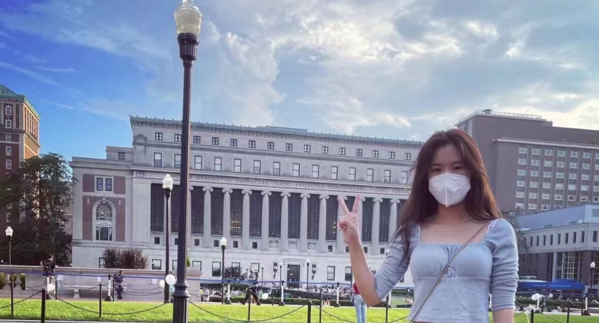
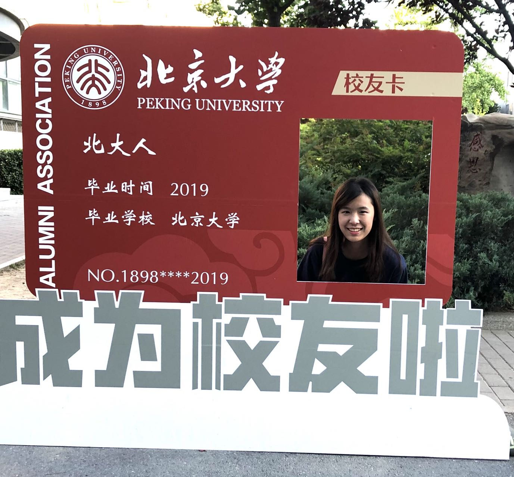
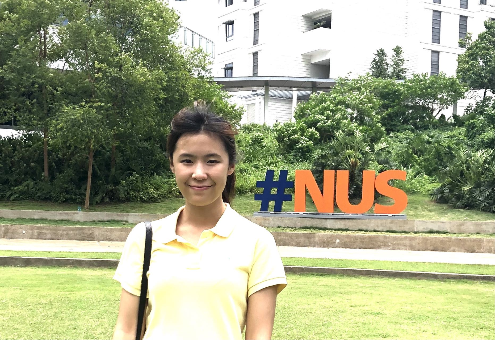
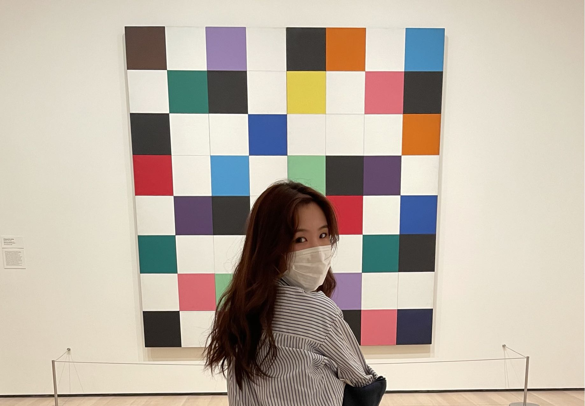
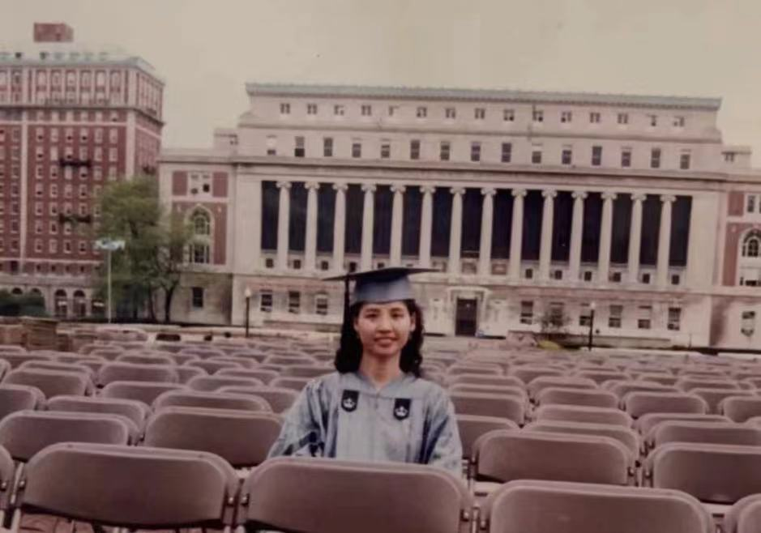

# A Biostatistics Master Student at the Columbia University

##More about me...
Welcome to my personal webpage and I would like to let you know more about me!
My name is Sze Pui, I come from Hong Kong. 
Having grown up in Hong Kong through the outbreaks of epidemic diseases, such as H1N1 swine flu, H3N2 seasonal flu, and even the SARS
in 2003, I was startled that even the most minuscule viruses could evoke irreversible catastrophes.I sincerely believed that it is our responsibility as
educated youth to devote our professional knowledge and make contribution to the betterment of the world!

Therefore, I majored Biology and Chemistry during my undergraduate study at City University of Hong Kong and participated in several
kinds of research related to microbiology!
In the summer of 2018, I had a internship experience in the technical services division of the Hong
Kong Police Force.My job was responsible for the project on the development of an image
processing algorithm, which aimed to train the computer distinguishing the counterfeit banknotes !

In 2019, I participated study exchange programs at Peking University and National University of Singapore.

After My undergraduate study, a new beginning starts  studying a master degree at the Columbia University.

More interestingly, my family also got their bachelor degree at Columbia University back to 1990s!
It is a serendipity that I will step into this lovely campus again after  23 years ! 

If you interested in my academic and professional experience, let's click into my [Resume](Resume.html) page.

